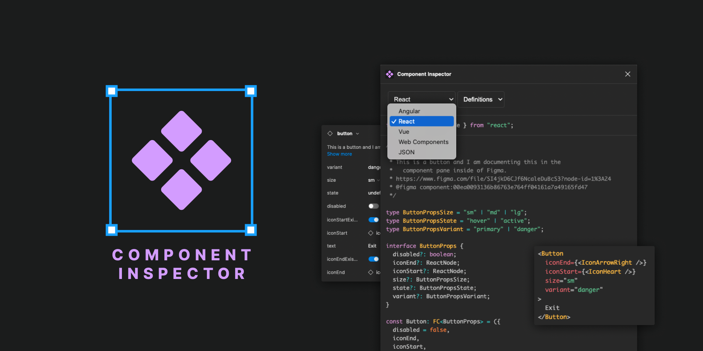

# Component Inspector

A [Figma plugin](https://www.figma.com/community/plugin/1162860898904210114) for inspecting Figma components.

Components and Component Properties are incredibly powerful features in Figma.

This plugin allows developers to inspect those properties in a mental model similar to the way they describe components.

This plugin does _not_ generate style code. It generates code for the language of components and the description of properties.

Currently supporting instance and component code generation for:

- React function components
- Angular components
- Vue components (both option and composition APIs)
- Web components

As well as:

- JSON

This is just the beginning! Would love to hear from you about what works and what is lacking.

## Conventions / Pro Tips

### Slots

Currently, this plugin supports tag-named slots. Add the `--SLOT[tagname]` suffix to the name of a text component property in Figma and it will generate a slot for that attribute. For example, if you create a component with a text property named `"heading--SLOT[h2]"`, it would generate the following React instance and definition code:

```tsx
<MyComponent heading={<h2>My slot content</h2>} />
```

```tsx
const MyComponent: FC<{ heading: ReactNode }> = ({ heading }) => <>{heading}</>;
```

The tagname will default to `span` if you use the suffix `--SLOT` without a tagname.

If your Figma component has a single text property, it will be treated as a generic slot.

### Boolean visibility

If you have a boolean Figma component property that controls visibility of a text or instance swap property, that boolean property will be ignored in generated code and the text or instance swap property will disappear when the boolean is false.

### `"undefined"` variant options and instance swaps

If you have a variant option property that defaults to the string `"undefined"`, that property will be treated as truly optional (no default).

If you have an instance swap property that defaults to a component named `"undefined"`, that property will be treated as truly optional (no default).

### Numeric variant options

If your variant options are all numeric, the generated code will treat it like a number type property.
